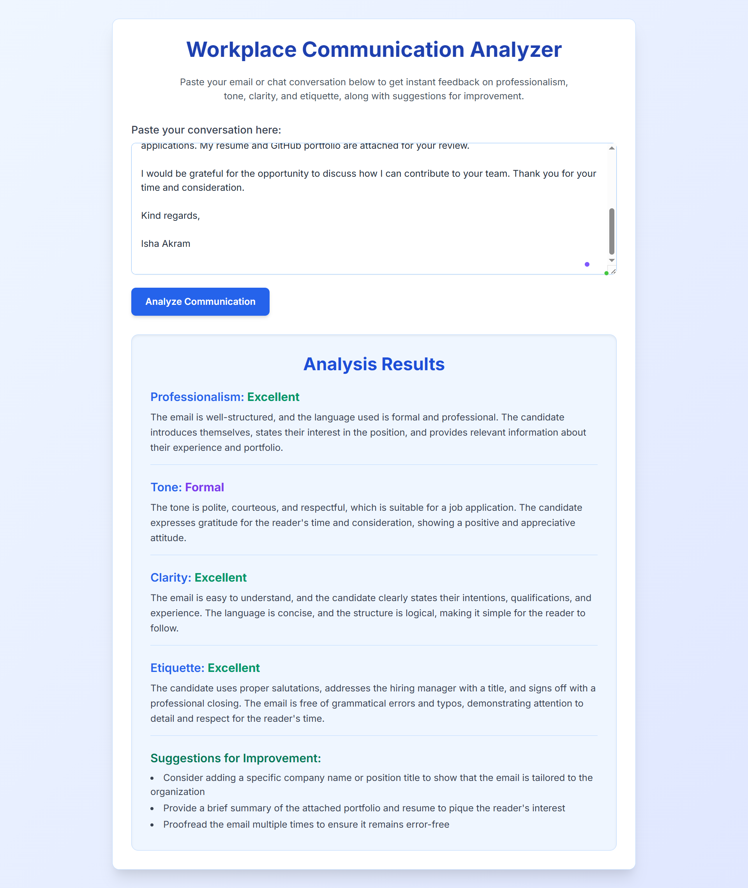

# Workplace Communication Analyzer

An AI-powered web application that analyzes workplace emails, messages, and written communication to help users improve professionalism, tone, clarity, and workplace etiquette.

Built with **Python**, **Flask**, **Groq API (Llama 3.3 70B)**, **HTML**, and **Tailwind CSS**.

---

## Features

- 🔍 Analyze workplace emails and chat messages
- 💼 Evaluate professionalism
- 😊 Detect communication tone
- ✍️ Assess clarity and readability
- 🤝 Review workplace etiquette
- ⚠️ Identify poor communication habits
- 💡 Provide actionable suggestions for improvement
- 📱 Clean and responsive user interface

---

## Technologies Used

### Backend
- Python
- Flask
- Groq API
- python-dotenv

### Frontend
- HTML5
- Tailwind CSS
- JavaScript

### AI Model
- Llama 3.3 70B Versatile (via Groq)

---

## 📂 Project Structure

```
workplace-communication-analyzer/
│
├── app.py
├── requirements.txt
├── .env
├── .gitignore
├── README.md
│
├── templates/
│   └── index.html
│
├── screenshots/
│   └── home.png
│   └── result.png


```

---

##  Getting Started

### 1. Clone the repository

```bash
git clone origin https://github.com/akramisha/workplace-analyzer.git

cd workplace-analyzer
```

---

### 2. Create a Virtual Environment

Windows

```bash
python -m venv .venv
.venv\Scripts\activate
```

Linux / macOS

```bash
python3 -m venv .venv
source .venv/bin/activate
```

---

### 3. Install Dependencies

```bash
pip install -r requirements.txt
```

---

### 4. Configure Environment Variables

Create a `.env` file in the project root.

```
GROQ_API_KEY=your_groq_api_key_here
```

You can obtain a free API key from:

https://console.groq.com/keys

---

### 5. Run the Application

```bash
python app.py
```

Open your browser and visit:

```
http://127.0.0.1:5000
```

---

## Analysis Categories

The application evaluates communication based on:

- Professionalism
- Tone
- Clarity
- Workplace Etiquette
- Poor Communication Habits
- Suggestions for Improvement

---

## Screenshots

| Home page | Result page |
|:---:|:---:|
|  |  |

---

## 🔒 Environment Variables

| Variable | Description |
|----------|-------------|
| `GROQ_API_KEY` | API key used to access the Groq AI model |

---

## ⚠️ Security

The API key is stored securely using environment variables (`.env`) and is **not included** in this repository.

---

##  Contributing

Contributions, suggestions, and improvements are welcome.

Feel free to fork the repository and submit a pull request.

---

## License

This project is licensed under the MIT License.

---

## Author

**Isha Akram**

Bachelor of Science in Information Technology

Passionate about AI, Web Development, and Human-Centered Intelligent Systems.

GitHub: https://github.com/akramisha
